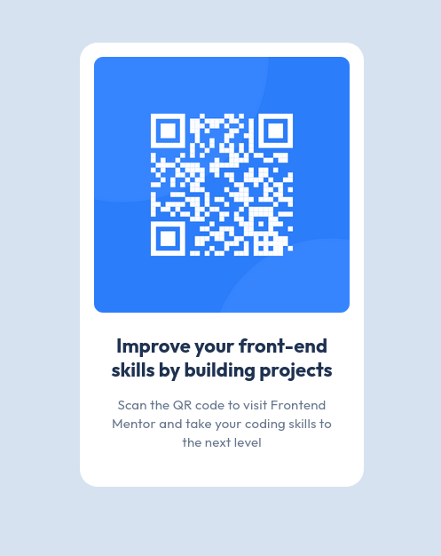

# Frontend Mentor - QR code component solution

This is a solution to the [QR code component challenge on Frontend Mentor](https://www.frontendmentor.io/challenges/qr-code-component-iux_sIO_H).

## Overview

### Screenshot

### Links

- [Solution URL](https://nik-i-net.github.io/qr-code-component/)
- [Live Site URL](https://github.com/Nik-i-Net/qr-code-component/blob/main/screenshot.png)
